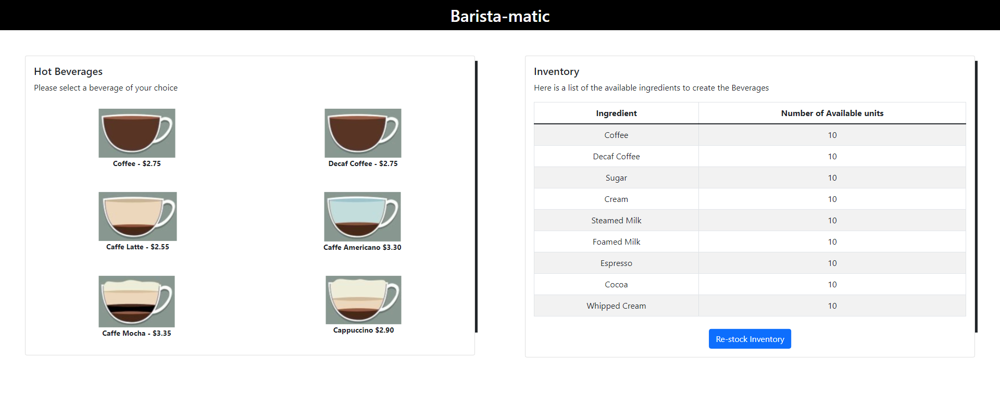

# Barista-matic Application

This is a simple React application where the the user can dispense beverages of his/her choice. <br />



It has been built with the following technologies:

<ul>
  <li>React.js</li>
  <li>React-bootstrap</li>
  <li>Redux</li>
  <li>Cypress</li>
</ul>

## Getting Started

Here are the steps that need to be performed to setup the environment for the project: <br />

1. Clone the repository

```sh

git clone https://github.com/rahul-balla/Barista-matic.git
```

2. Install npm packages

```sh

npm install
```

## Running the application

1. Starting application in dev mode

```sh

npm run start
```

2. Starting production ready environment

```sh

npm build
```

## Testing the application

Run the command `yarn run cypress open` to run the tests for the application. This will open another window where you can view the tests performed in detail.
